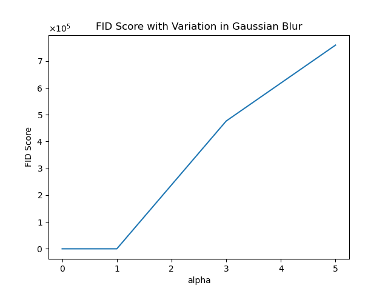
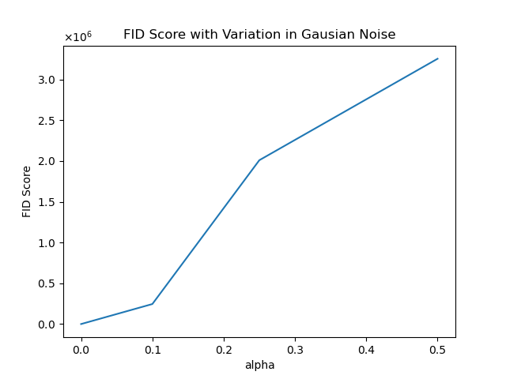
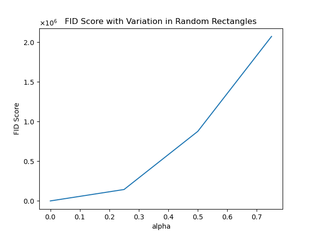
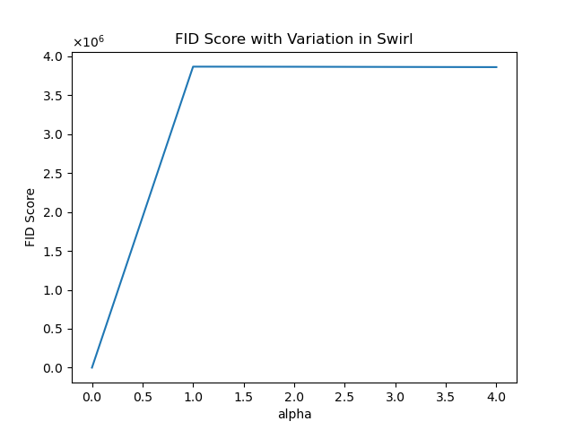
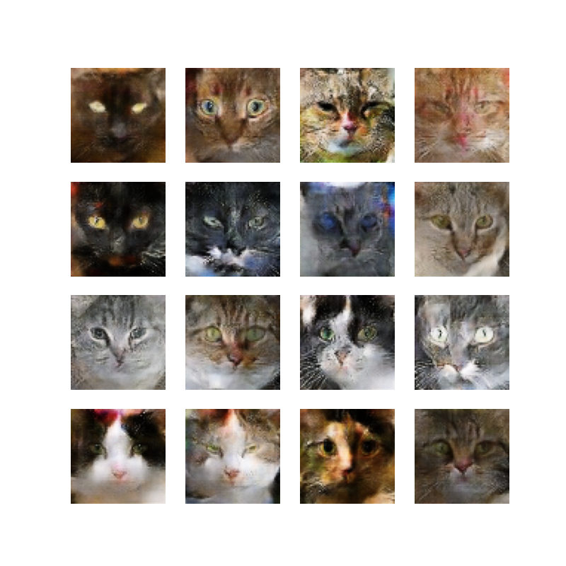
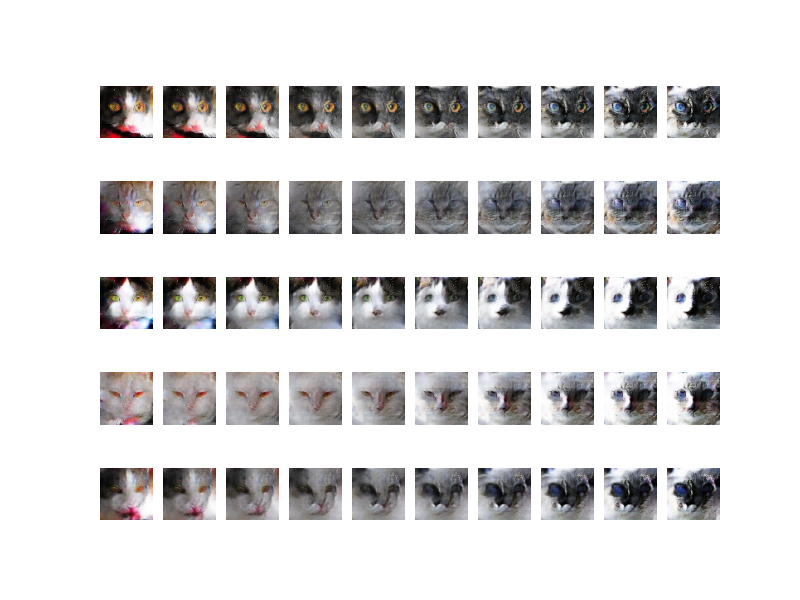

# PIC16B GAN Project

## Overview
Our project implements a deep convolutional adversarial network (DCGAN) using
the keras library. The DCGAN is made by creating a generator and discriminator
model. The generator creates artificial images while the discriminator acts as
a binary classifier. As the model trains, both the generator and discriminator
weights are updated as they approach an equilibrium. To aid the models in
reaching an equilibrium, each model was trained with a different learning
rate. Both the generator and discriminator were implemented using 4
convolutional layers. The code for our DCGAN can be seen in the `gan.py` file.
We trained our model on a
[cat dataset](https://www.kaggle.com/spandan2/cats-faces-64x64-for-generative-models)
containing 15.7k images. Training the
model took about 4 hours with 500 epochs.

To evaluate the model we used the
[Frechet Inception Distance as described in the GANs Trained by a Two Time-Scale Update RuleConverge to a Local Nash Equilibrium](https://arxiv.org/abs/1706.08500) paper. 
...

## Discussion
To evaluate our GAN model, we applies the Frechet Inception Distance (FID). FID was first proposed in the paper, [Frechet Inception Distance as described in the GANs Trained by a Two Time-Scale Update RuleConverge to a Local Nash Equilibrium], as an improvement for Inception Score. According to the paper, the distribution of real data and generated data are assumed to follow a Gaussain distribution. Hence, FID is a way of quantifying the difference between the two distributions. To calculate FID score, we first used a pretrained InceptionV3 network without the final output layer to extract features from both generated images and real-world images. The formula for FID calculation, proposed by the paper,  is presented as follow, <br />
            <br />
where m denotes the feature-wise mean from  generated images; m_w denotes the feature-wise mean from  real-world images; C and C_w are the covariance matrices obtained by generated images and real-world images respectively. Lower FID score indicates less difference between distributions generated images and that of real world images. 





### Frechet Inception Distance at Intervals of 10 Epochs
We want to explore how FID scores improves throughout training. We saved the generator models to calculate FID scores every 10 epochs. Hence, we obtained the graph below, where we see a desirable decrease of FID score, meaning that our generated data got closer to the distribution of the training data. Throughout training, we obtained a lowest FID score, 466, and the FID score for our final model is 676.094. 


## Training Results



Generator output after 500 epochs.


Training Process from epoch 5 to epoch 500.

## Interpolation

Observing how the model reacts to variation in the input space.

## GAN Class
The GAN class is contained in the `gan.py` file. The following is a list of 
useful class methods.

- `load_model()` restores the last trained model

- `save_model()` saves the last trained model

- `train()` trains the model and outputs generated images every 5 epochs into
the `epochs` folder

- `summary()` outputs a summary of GAN model

- `plot_generated_images(filename)` plots a 4x4 grid of images generated by the
model at `filename`

- `FID(sample_size)` evaluates the current generator model with the frechet
inception distance score using a random sample of size `sample_size`


## Example Usage

The following examples demonstrate how to use the GAN class. 


### Load a Model
The `main.py` file demostrates how to load a previously trained GAN model
and output new images generated by the model.

```
from gan import GAN

# Load last trained model to skip training time
gan_model = GAN()
gan_model.load_model()
# save a 4x4 grid of images generated by the model
gan_model.plot_generated_images('generated_images')
# Prints the generator, discriminator, and GAN model summary
gan_model.summary()
```


### Train the Model
The `training.py` file demonstrates how to create a model with specified
hyperparameters. Every 5 epochs the model will output images will to `epochs`
to visualize trianing progress. The following code can take several hours to 
run.

```
from gan import GAN

# hyper parameters
BATCH_SIZE = 128
DISCRIMINATOR_LR = 5e-5
GENERATOR_LR = 2e-4
EPOCHS = 500
ALPHA = 5e-1


# training the model from scratch
gan_model = GAN()
# train the model wtih the given hyperparamters
gan_model.train(BATCH_SIZE, DISCRIMINATOR_LR, GENERATOR_LR, ALPHA, EPOCHS)
# save a 4x4 grid of images generated by the model
gan_model.plot_generated_images('generated_images')
# print a summary of the generator, discriminator, and GAN model
gan_model.summary()
# save model
gan_model.save_model()
```


## References

https://arxiv.org/abs/1706.08500

https://www.tensorflow.org/tutorials/generative/dcgan

https://www.kaggle.com/spandan2/cats-faces-64x64-for-generative-models

https://machinelearningmastery.com/how-to-implement-the-frechet-inception-distance-fid-from-scratch/

https://machinelearningmastery.com/how-to-develop-a-generative-adversarial-network-for-an-mnist-handwritten-digits-from-scratch-in-keras/
